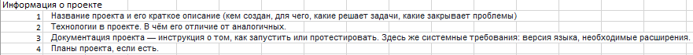
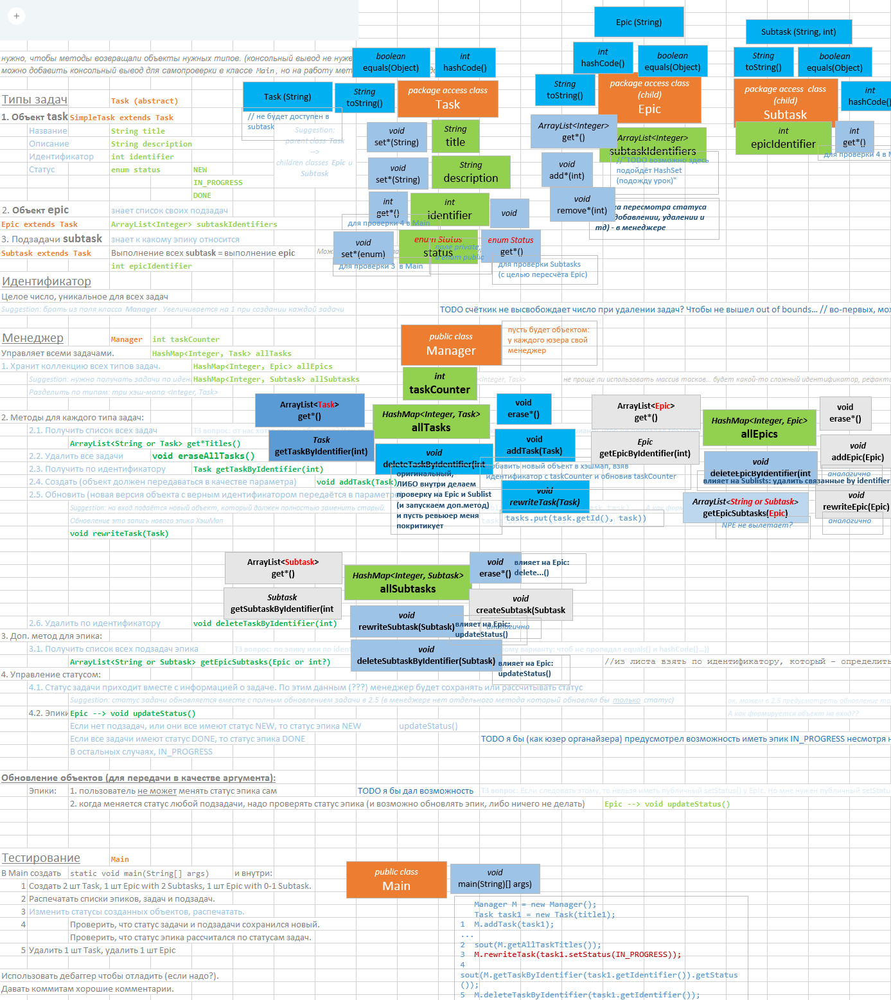

# Трекер задач
README в процессе обновления.

Добавить:

Для разбора ТЗ использовал Excel (disclaimer: полученный драфт не полностью соответствует текущей версии кода):

Возможно более эффективно сразу писать код или интерфейс